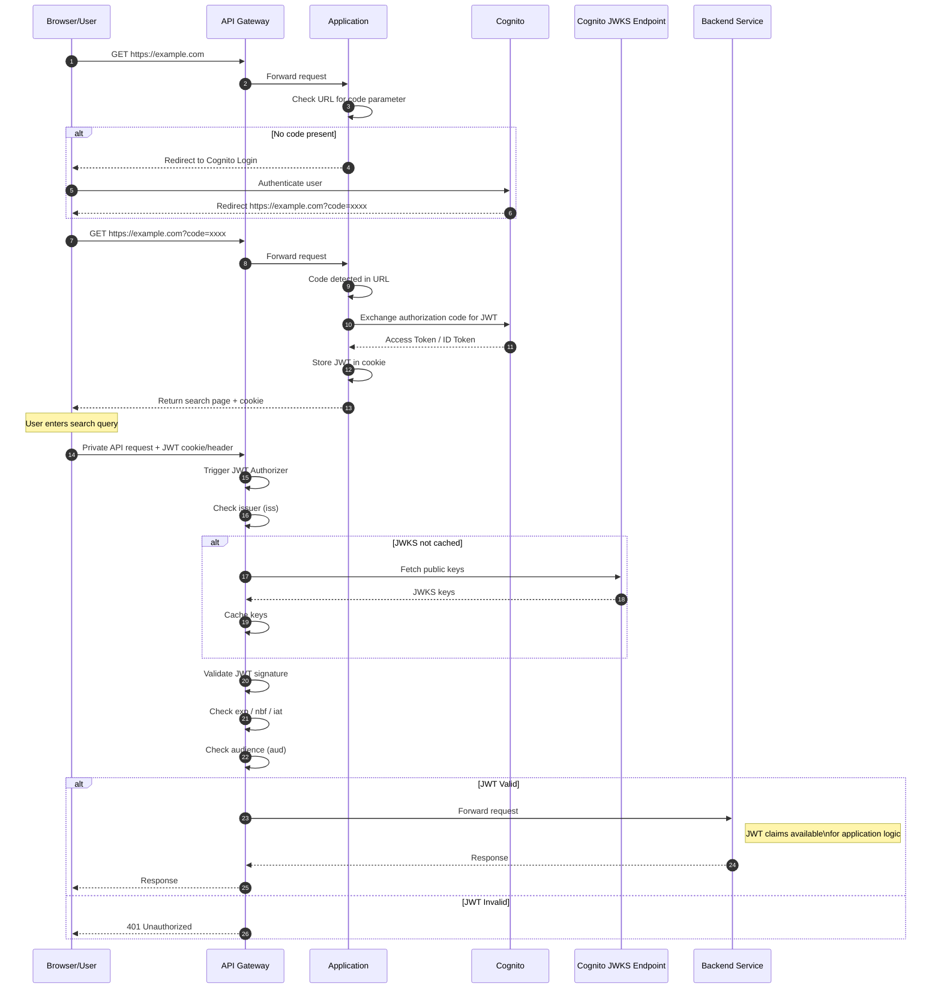

```mermaid
sequenceDiagram
    autonumber

    participant U as Browser/User
    participant APIGW as API Gateway
    participant APP as Application
    participant COG as Cognito
    participant JWKS as Cognito JWKS Endpoint
    participant BE as Backend Service

    U->>APIGW: GET https://example.com
    APIGW->>APP: Forward request

    APP->>APP: Check URL for code parameter

    alt No code present
        APP-->>U: Redirect to Cognito Login
        U->>COG: Authenticate user
        COG-->>U: Redirect https://example.com?code=xxxx
    end

    U->>APIGW: GET https://example.com?code=xxxx
    APIGW->>APP: Forward request

    APP->>APP: Code detected in URL
    APP->>COG: Exchange authorization code for JWT
    COG-->>APP: Access Token / ID Token

    APP->>APP: Store JWT in cookie
    APP-->>U: Return search page + cookie

    Note over U: User enters search query

    U->>APIGW: Private API request + JWT cookie/header

    APIGW->>APIGW: Trigger JWT Authorizer

    APIGW->>APIGW: Check issuer (iss)

    alt JWKS not cached
        APIGW->>JWKS: Fetch public keys
        JWKS-->>APIGW: JWKS keys
        APIGW->>APIGW: Cache keys
    end

    APIGW->>APIGW: Validate JWT signature
    APIGW->>APIGW: Check exp / nbf / iat
    APIGW->>APIGW: Check audience (aud)

    alt JWT Valid
        APIGW->>BE: Forward request
        Note right of BE: JWT claims available\nfor application logic
        BE-->>APIGW: Response
        APIGW-->>U: Response
    else JWT Invalid
        APIGW-->>U: 401 Unauthorized
    end
```
